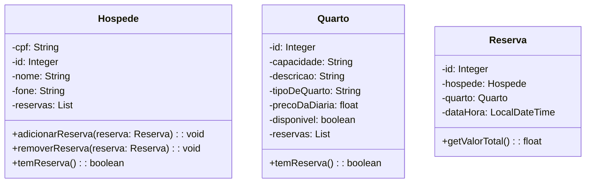

# Gerenciamento de Hotel

----------------------- Divisão de Tarefas ---------------------------------
Nauan
Responsável pela criação do Menu principal, Menu Reserva, ReservaDAO, entidade Reserva e também pela criação do diagrama de classes através da ferramenta Mermaid

Victor
Responsável pela entidade Hospede, Quartos, Menu de ambos, HospedeDAO, QuartosDAO e preenchimento do Banco de Dados.
----------------------- // ---------------------------------

Aplicação JPA com Spring Boot e Spring Data JPA.

A aplicação possui menus e sub-menus para cadastro de hospedes, quartos e reservas de quartos.

